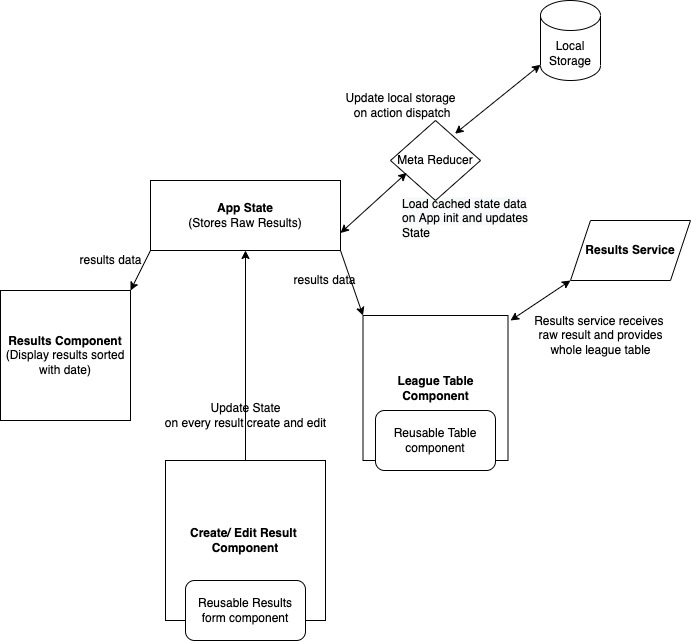

# Demo App

This is the repository for Interview Demo.

## Project Structure


The project structure is as follows.

```
--> src                                 // Main angular application
-------> core                           // Contains services and interfaces
-------> components                     // Components
-------> state                          // App State
```




## Requirements
```

Node 14
NPM 7
Angular 13 `npm install -g @angular/cli`

```

## Used Packages
```
Bootstrap              // css framework
@ngrx/store            // State Management
@ngrx/store-devtools   // dev tool for NgRx
```


## Getting started

```
git@github.com:Sushilkarki77/league-table-porto.git
cd interview-demo-1
npm install
ng serve
```

## Demo
[https://interview-demo-sk.herokuapp.com](https://league-table-porto.web.app/)
